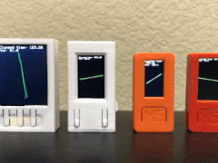

# stevesch-Display

This library wraps up TFT_eSPI for a number of boards and provides backbuffer-style display refreshing, i.e. like most games.
TFT setup uses DMA or multi-core copy when available, allowing for excellent frame rates on 
small TFT displays (loop times of 100+ fps on small displays like M5 StickC or StickC plus).


Simple example of backbuffered animation on (left-to-right) TTGO-TS, TTGO T-Display, M5StickC, M5StickC Plus:



The above demo animation is available in the examples/minimal folder of the workspace.

A more sophisticated use showing 3D rendering can be found here:
[stevesch-Mesh](https://github.com/stevesch/stevesch-Mesh)
<br/>
<br/>

# Building and Running

For a basic example, clone this repo and open the folder in PlatformIO.

The PlatformIO Project Tasks contains build configurations for various boards (TTGO T-Display, M5StickC, generic ESP32 devkit board, etc.).  Attach your board via a serial port, then select "Upload" under the section for your board in the Project Tasks.  This will build the example project, upload it to your board, and start it running.

<br/>
---

### Code required to add to an existing sketch is essentially
<br/>
define display:

```
#include <stevesch-Display.h>

stevesch::Display display(TFT_WIDTH, TFT_HEIGHT);
```

setup display:

```
void setup()
{
  display.setup();
}
```

draw each frame:

```
void loop()
{
  // begin each frame by clearing the render target:
  display.clearRenderTarget();

  // Then grab the render target for drawing:
  TFT_eSPI* renderTarget = display.currentRenderTarget();

  // add your draw calls here, e.g.
  // renderTarget->drawLine, renderTarget->print(text), etc.

  // finally, call "finishRender"
  // - finalizes the current backbuffer
  // - sends it to the display
  // - prepares the next backbuffer for next frame
  display.finishRender();
}
```


